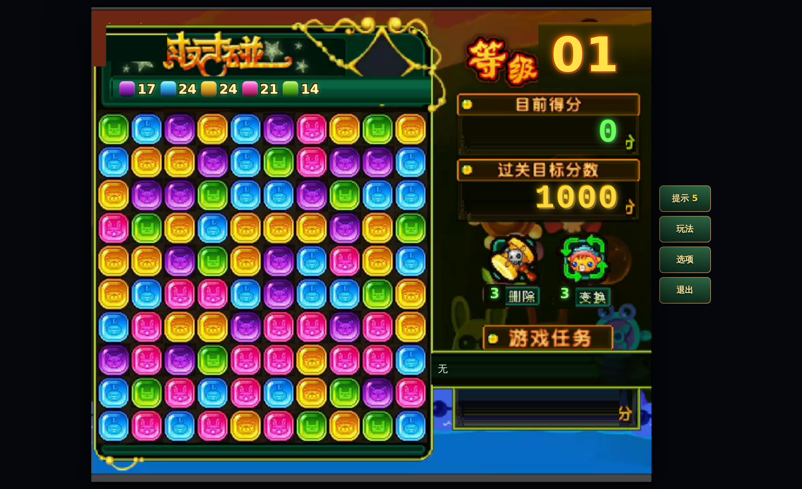
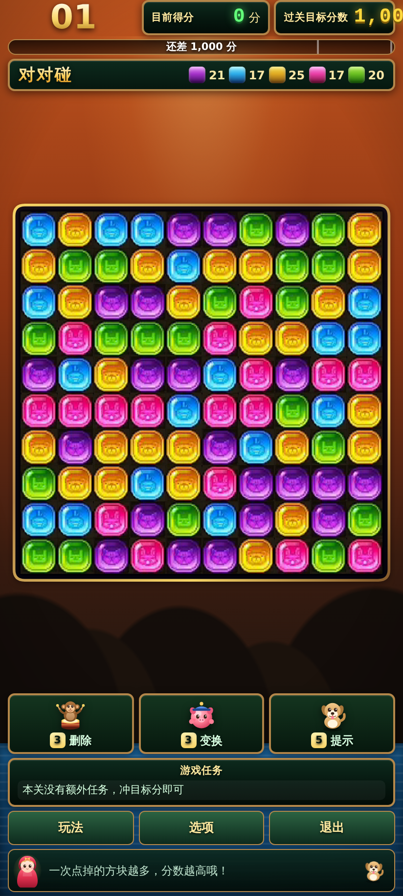
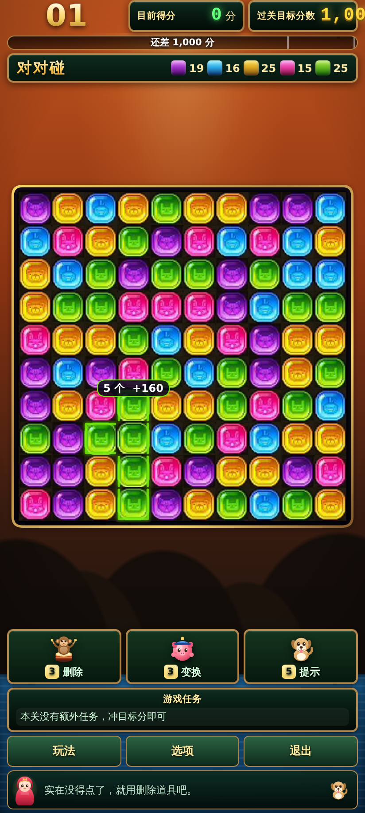

# 对对碰

联众世界 Flash 版《对对碰》的复刻。纯 HTML5，**安卓手机浏览器直接能玩**，也能装成桌面图标（PWA），或打包成 APK。

<p align="center">
  <br>
  <em>原版还原模式：界面底板、方块、背景音乐全部取自原版</em>
</p>
<p align="center">
  
  
  <br><em>手机竖屏版式：同一套引擎，重新排版以适配单手操作</em>
</p>

---

## 玩法

棋盘铺满带小动物的彩色方块，**点击上下左右相连、两个以上的同色方块**，整组一起消失。

- 斜着挨在一起**不算**相连；孤零零的单个方块点不掉
- 消除后空位由**上方的方块掉下来**填补；**整列清空**时右边的列**整体向左合拢**
- **一次消掉的方块越多，分数涨得越猛**（得分按组大小的二次方增长）
- 本局结束时**剩下的方块越少，奖励分越高**，全清还有额外大奖
- 达到本关**目标分数**即可过关；棋盘上再也找不到可消组合时，本局结束

### 特殊方块

| | 名称 | 说明 |
|---|---|---|
| ✨ | **魔术方块** | 点它不会消除，而是**换成下一种颜色**。它按当前颜色参与相连判定，所以可以切成需要的颜色，**把两片分开的色块接起来**，再点旁边的普通方块一起带走 —— 相当于任意配 |
| 🪨 | **顽石** | 不参与任何消除，点了没反应，只能用「删除」道具清掉。第 12 关起出现 |

### 道具

先点道具图标激活（图标会发光），再点棋盘上的位置使用；再点一次图标可取消。

| 道具 | 效果 |
|---|---|
| **删除** | 直接删掉任意一个方块，不受相连规则限制，顽石也能清。被删掉的方块不计分 |
| **变换** | 把点击处的十字五格染成同一种颜色，硬造一组可消方块 |
| **提示** | 指出当前最大的一组可消方块，扣少量分 |

### 关卡

- 第 1 关目标 **1000 分**，10×10 棋盘，5 种方块
- 每 5 关棋盘长高一行，最多长到 10×14
- 第 3 关起出现魔术方块，第 12 关起出现顽石
- 第 6 关起出现**游戏任务**（消除指定颜色若干个、单次消除达到多少个、通关时剩余不超过多少等），完成有一大笔奖励分

---

## 两套画面

| 模式 | 说明 |
|---|---|
| **原版还原** | 680×580 的固定画面，底板是从原版录屏里抠出来的整块界面，棋盘精确落在原坐标 (7,130)、格子 40px，与原版逐像素对位。横屏或桌面自动启用 |
| **手机版式** | 同一套引擎重新排版：信息分列棋盘上下，棋盘居中占满剩余空间，方块更大更好点。竖屏自动启用 |

设置里可以强制其中一种。

---

## 声音

背景音乐是**《Clarinet Polka》**（波兰传统民谣，公有领域）—— 音符是从原版录屏的音轨里扒出来的：对每个十六分音符窗口做 FFT 取主频，投票去噪、修正八度错判，转成音符数据在本地合成。这样既能无缝循环、又不用带任何音频文件。不同章节会自动移调换音色。

音效参数同样取自实测：把录屏音轨减掉背景音乐后做频谱分析，得到

- **消除音**：242 / 308 / 362 Hz 的大三和弦，中频四成、高频三成，起音极快、约 250ms 衰减；一次消得越多整体移调越高
- **点击音**：3.4 kHz 的短促 tick

全部用 Web Audio 实时合成，安装包里一个音频文件都没有。`docs/bgm-preview.wav` 是纯旋律试听版。

---

## 怎么玩到

### 手机上直接玩

把这个仓库部署到任意静态托管（GitHub Pages / Vercel / Netlify 都行），手机浏览器打开即可。Chrome 里选「添加到主屏幕」，就会像一个独立 App 一样全屏运行，**装完断网也能玩**。

### 本地跑

```bash
npm run dev        # 起一个本地服务器，浏览器打开 http://localhost:8080
```

> 注意：必须用 http 打开。直接双击 `index.html`（`file://` 协议）会因为浏览器的模块与 Service Worker 限制而跑不起来。

### 打包成 APK

仓库里已经带好了完整的安卓工程（Capacitor），**不需要本机装 Android Studio**：

1. 打开 GitHub 仓库的 **Actions** 页
2. 选 **「构建安卓 APK」** → **Run workflow** → 选 `debug`
3. 跑完在 Artifacts 里下载 APK，传到手机安装即可

打 `v1.0.0` 这样的 tag 会自动出 release 包并建一个 Release。想要签名的正式包，在仓库 Secrets 里配上 `ANDROID_KEYSTORE_BASE64` / `ANDROID_KEYSTORE_PASSWORD` / `ANDROID_KEY_ALIAS` / `ANDROID_KEY_PASSWORD` 即可。

本机有 Android SDK 的话：

```bash
node tools/build.mjs          # 收集网页资源到 dist/
npx cap sync android          # 同步进安卓工程
cd android && ./gradlew assembleDebug
```

---

## 项目结构

```
src/
  core/          引擎，不依赖任何浏览器 API，可在 Node 里直接跑
    board.js       棋盘：分组判定、消除、重力填补、空列合拢、魔术方块
    game.js        一局游戏：计分、任务、道具、胜负判定
    stage.js       关卡：目标分、颜色数、特殊方块比例、任务生成
    config.js      所有可调数值都集中在这里
    companion.js   看板娘与小狗的台词
    rng.js         可复现随机数
    util.js        工具函数与事件总线
  render/        渲染
    renderer.js    Canvas 绘制：棋盘、选中高亮、提示、道具光标、飘字
    sprites.js     方块贴图：优先用原版素材，缺失时退回程序化绘制
    assets.js      原版贴图加载
    particles.js   粒子特效（对象池，不产生 GC 抖动）
  ui/            界面
    hud.js         手机版式的顶栏、分数、任务、道具、颜色计数条
    stage.js       原版还原模式：把数值按原坐标叠回底板
    screens.js     标题、关卡选择、暂停、结算、玩法说明、设置
    dom.js         DOM 小工具
  platform/
    storage.js     本地存档（隐私模式下也不会崩，只是不记进度）
  main.js        串起所有模块：启动、输入、主循环

assets/
  blocks/        从原版录屏提取的方块贴图
  stage/         原版还原模式的界面底板
  art/           角色立绘（SVG，自绘）与提取素材的中间产物
  icons/         应用图标
tools/           自测与调参工具（见下）
android/         Capacitor 安卓工程
```

---

## 开发

```bash
npm run check          # 逐个 import 所有模块，检查语法与引用
npm test               # 引擎自测（58 项，不需要浏览器）
npm run test:browser   # 浏览器端烟囱测试（46 项，真跑一遍 + 截图）
npm run test:audio     # 音频自测（11 项：曲谱对账 + 真跑一遍音频引擎）
npm run balance        # 难度曲线校验
npm run curve          # 重新标定单格产出
npm run shots          # 各种视口下截图
npm run icons          # 重新生成应用图标
```

### 数值是怎么定的

不是拍脑袋定的，是量出来的：

- **`tools/rip.py`** 把原版录屏的棋盘逐格切开，多帧中位数叠加去噪后聚类，自动分出原版的 5 种方块和魔术方块。**「方块会从上往下掉落」这条规则就是这么确认的** —— 解出每帧的占位矩阵后发现每一列都严格底对齐，且消除一格后该列上方整体下移一行。
- **`tools/finalize-assets.py`** 从提取出的贴图里反推每种颜色的主色、高光、暗部，写进 `GEM_COLORS`，所以 UI 上的色块、粒子、发光和棋盘方块是同一套颜色。
- **单组得分系数 = 10**：录屏里连续两次「消掉 2 个」，分数都是 300→320→340，即 `n=2` 恰好 20 分，反推 `10×n×(n−1)`。
- **`tools/curve.mjs`** 用机器人在真实棋盘上跑几千局，实测出「单格期望产出分」。
- **`tools/balance.mjs`** 用四档水平的机器人（乱点 / 见大就吃 / 先清小块 / 一层前瞻）校验每一关，确保目标分落在「认真玩能过、乱点会输」的区间里。目标分 = 可达分 × 难度压强，60 关全程单调不降。

改了 `src/core/config.js` 里的数值后，跑一遍 `npm run balance` 就能看到难度曲线有没有被弄坏。

---

## 关于素材

`assets/blocks/` 下的方块贴图与 `assets/stage/` 下的界面底板是**从原版游戏录屏里提取**的（做法见 `tools/rip.py`、`tools/make-stage.py`），著作权属于联众。这是一个学习与怀旧性质的复刻，**请勿用于商业用途**。

需要公开分发的话：

- 把 `assets/blocks/` 换成自己的美术即可 —— 引擎不依赖这些图，贴图加载失败时 `sprites.js` 会自动退回到程序化绘制的方块（糖果色块 + 小动物脸），游戏照常能玩
- 在设置里把画面模式固定为「手机版式」，或删掉 `assets/stage/`，就不会用到原版底板

背景音乐《Clarinet Polka》是波兰传统民谣，本身在公有领域；曲谱与合成代码为本项目所写。

`assets/art/` 下的角色立绘、`assets/icons/` 下的图标都是本项目自绘的 SVG / 程序化生成，可自由使用。

代码以 MIT 协议开源。
